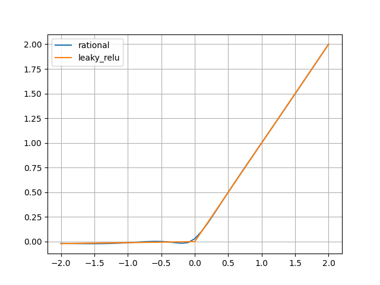

Make a rational Network in Pytorch
==================================

To use Rational in Pytorch, you can import the Rational module and instantiate a
rational function:

.. literalinclude:: code/how_to_use_rationals.py
   :lines: 1-6

depending on CUDA available on the machine.

To place the rational function on the cpu/gpu:

.. literalinclude:: code/how_to_use_rationals.py
   :lines: 8-9

To inspect the parameter of the rational function

.. literalinclude:: code/how_to_use_rationals.py
    :lines: 11-16

If you now want to create a Pytorch Rational Network class:

.. literalinclude:: code/how_to_use_rationals.py
    :lines: 18-72

Now we can instanciate a Rational Network and a Recurrent Rational Networl and
pass them inputs.

.. literalinclude:: code/how_to_use_rationals.py
    :lines: 75-89

To see the activation function:

.. literalinclude:: code/how_to_use_rationals.py
    :lines: 92-102

