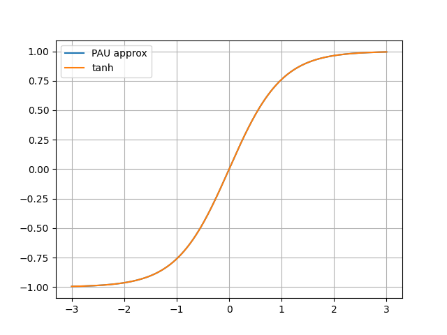

Find weights for Rational approximating new functions
=====================================================

If you want your function to approximate a function that is not already in
`rational/rationals_config.json`, you have to run a script that would automatically find
the coefficient of P and Q and add them to your the file.

This script uses `numpy`, `scipy`, and `matplotlib` so be sure to have them installed.

.. literalinclude:: code/find_weights_for_initialization.py
   :lines: 1-2

Then call the `find_weights` function with and pass it the function you want to
approximate. We'll take `tanh` in this example.

.. literalinclude:: code/find_weights_for_initialization.py
  :lines: 4

You will be asked to provide the parameters you'd like for the rational
functions. We provide here some example of those, that are the default ones.

.. literalinclude:: code/find_weights_for_initialization.py
  :lines: 6-12

After computation (can take some time) found weights will be printed:

.. literalinclude:: code/find_weights_for_initialization.py
  :lines: 14-17

You will be asked if you want to see a plot of the obtained rational function.

.. literalinclude:: code/find_weights_for_initialization.py
  :lines: 19

If you accept, you will be shown a plot (to check the accuracy):

Then, you will be asked if you want to store this result for latter use.

.. literalinclude:: code/find_weights_for_initialization.py
  :lines: 21

If you say yes, then you can now use this function to initialise your rational
function:

.. literalinclude:: code/find_weights_for_initialization.py
  :lines: 23-27

We can check that we obtain the same weights as the one found above:

.. literalinclude:: code/find_weights_for_initialization.py
  :lines: 28-32

You now now how to add an function to the init file !
