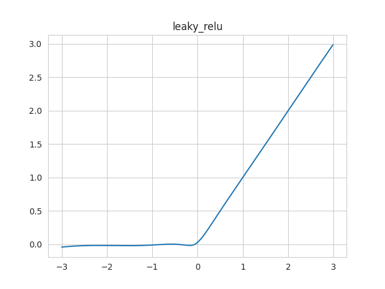
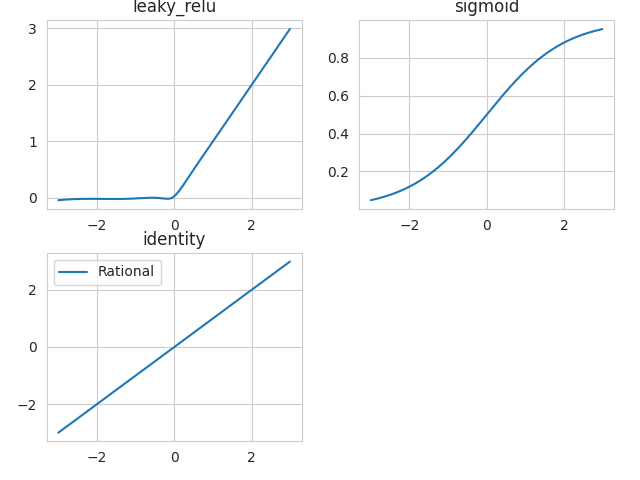
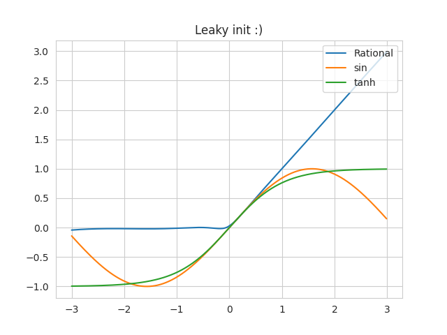
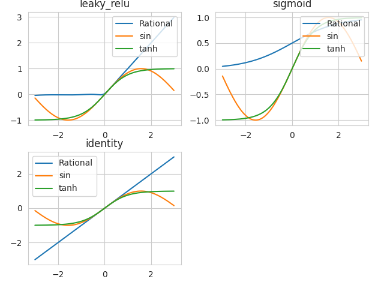
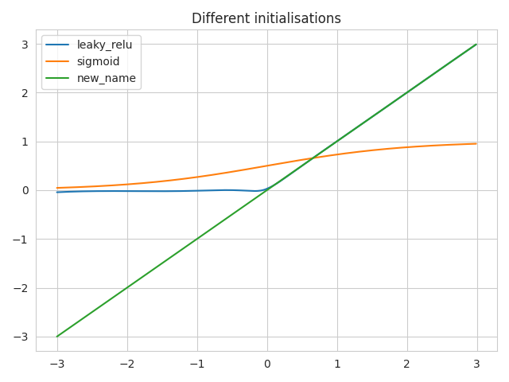
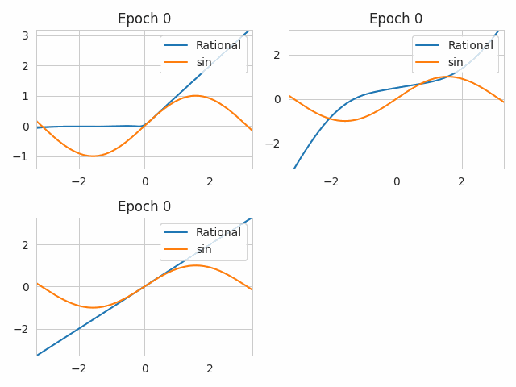
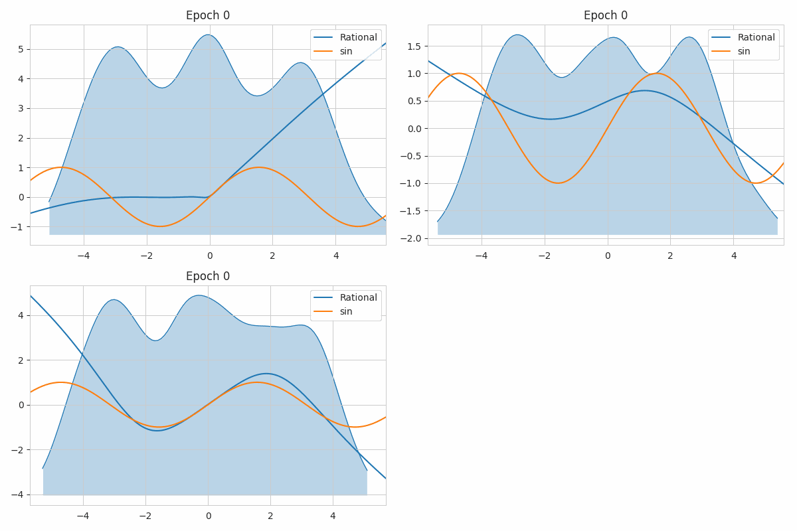
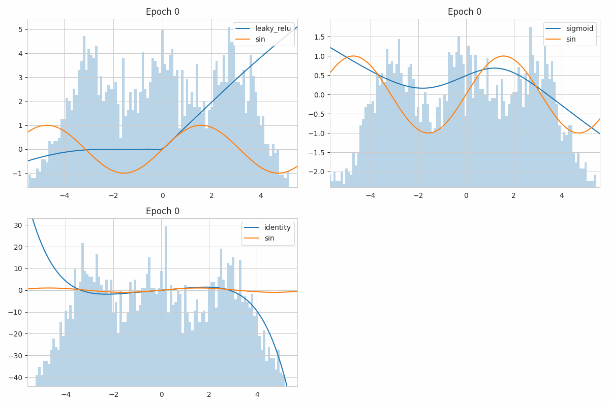
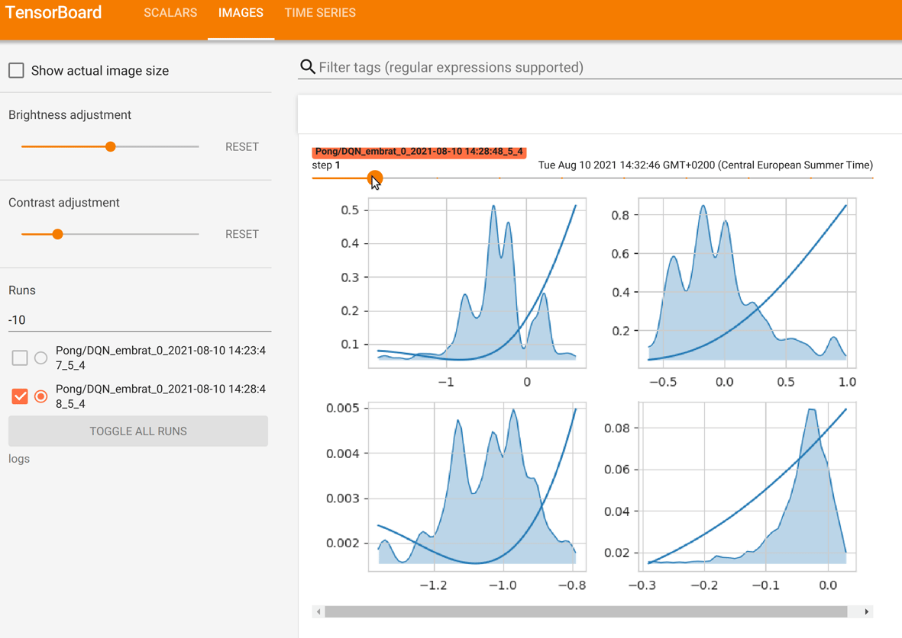

Visualise and debug the functions
=================================

In this tutorial, we are going to visualise Rational Functions.

Visualise

First let's create some rational functions

.. literalinclude:: code/visualize.py
  :lines: 1-5

Then let's call the :meth:`~rational_torch.Rational.show` method to visualize
it.

.. literalinclude:: code/visualize.py
  :lines: 7

We can also visualise every instanciated rational function. They are stored
in the :attr:`list` attribute of the :class:`~rational_torch.Rational` module:

.. literalinclude:: code/visualize.py
  :lines: 9-13

They correspond to the 3 rational functions we have instanciated.
To see them all, use the class method :meth:`~rational_torch.Rational.show_all`:

.. literalinclude:: code/visualize.py
  :lines: 15

The visualisation of the functions is based on :class:`~rational.utils.Snapshot`.
When we call :meth:`~rational_torch.Rational.show` or
:meth:`~rational_torch.Rational.show_all`, a Snapshot is created and displayed.

You can capture snapshot at a specific point during your experiment and it
will be stored in :attr:`snapshot_list` of the specific rational function:

.. literalinclude:: code/visualize.py
  :lines: 17-21

Now you can use the :meth:`~rational.utils.Snapshot.show` method to display
the captured snapshot. You can even compare it to other functions by using `other_func`.

.. literalinclude:: code/visualize.py
  :lines: 23-24

You can, of course pass this parameter to the
:meth:`~rational_torch.Rational.show_all` function

.. literalinclude:: code/visualize.py
  :lines: 26

we can also directly save the graphs instead of displaying it, by using the
:meth:`~rational_torch.Rational.export_graph` and classmethod
:meth:`~rational_torch.Rational.export_graphs` of our rational.

You can also give your own axis to visualise all instanciated function on the
same axis or chery pick the functions you want to vizualize on the same graph:

.. literalinclude:: code/visualize.py
  :lines: 29-42

Visualise the functions' evolutions through learning
----------------------------------------------------

We can also look at the evolution of the functions, while learning.
To do so, we capture snapshots at different epochs.
Let's define have 3 rational functions, initialized differently, and have
them learn the sinus function. We capture at different epochs.

.. literalinclude:: code/visualize2.py
  :lines: 1-27

We obtain a file `rationals_evolution.gif`:

For learnable activation functions, learning the input distribution might
help a lot understand what happens within the activation functions.

For the **pytorch version** of Rational activations, we can use the classmethod
:meth:`~rational_torch.Rational.save_all_inputs` to save the input distribution.

.. literalinclude:: code/visualize2.py
  :lines: 30-46

If you want to see histograms instead of the KDE of it, you can use the
:attr:`use_kde` of the :class:`~rational_torch.Rational` class:

.. literalinclude:: code/visualize2.py
  :lines: 29

Use a tensorboardX SummaryWriter to plot the evolutions
-------------------------------------------------------

You can also follow the learning of your functions by looking at evolutions
of the function in a tensorboardX.SummaryWriter, to do so, give the writer to
the :meth:`~rational_torch.Rational.show` or
:meth:`~rational_torch.Rational.show_all` method and the evolution of the
rational functions' shapes will be provided to the tensorboard webpage.

An example code is:

.. literalinclude:: code/visualize2.py
  :lines: 1 - 23

Provides on tensorboard webpage:

The code is taken from the `Rational_RL repository<https://github.com/ml-research/rational_rl>`_
